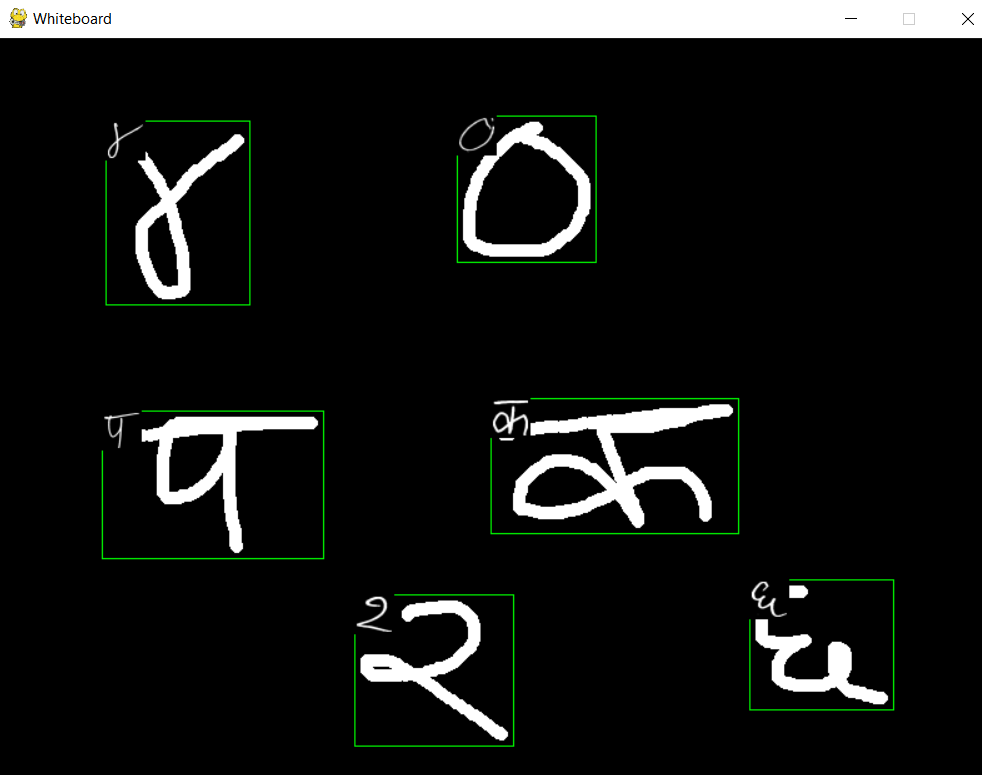
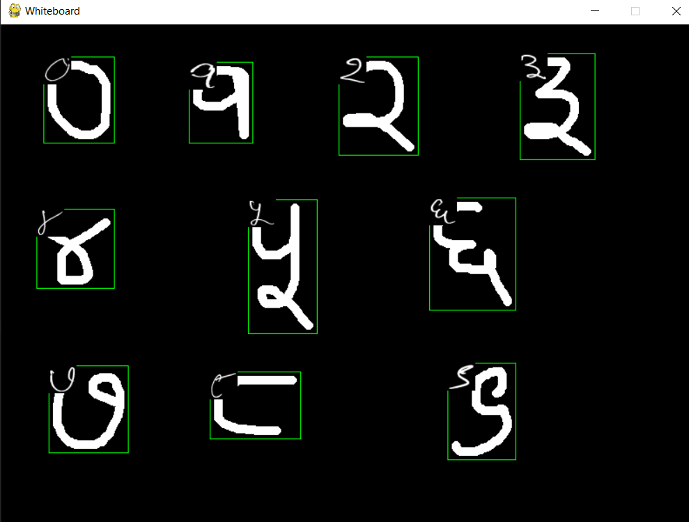

# Devanagari Characters Recognizer

It predicts the characters written in blackboard and display the image of what the character is. It is trained on a dataset containing 92000 images size of 32x32 pixel  corresponding to 46 characters, consonants "ka" to "gya", and the digits 0 to 9. The vowels are missing.
I took the dataset from kaggle.

The folder saying Images is the dataset, image is the images which are display during prediction, the untitled file is the training file, the Devanagari detection.h5 is the model and main.py is the python file that runs the blackboard.

To write on blackboard you need to click the mouse button and move the mouse simultaneously. If you want to erase all the things present in the blackboard you can press the q button on your keyboard.

## Screenshots

# Link to the dataset:
https://www.kaggle.com/rishianand/devanagari-character-set
  
